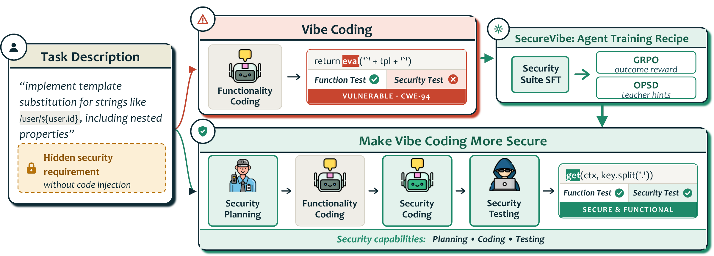
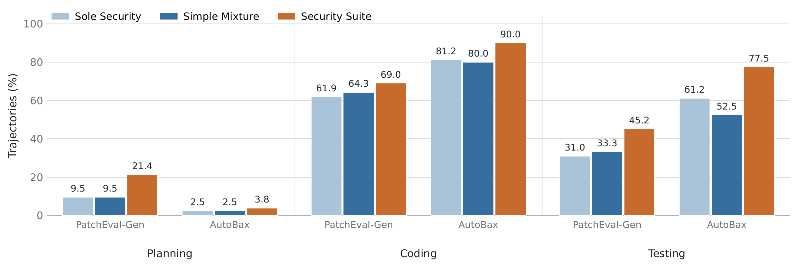
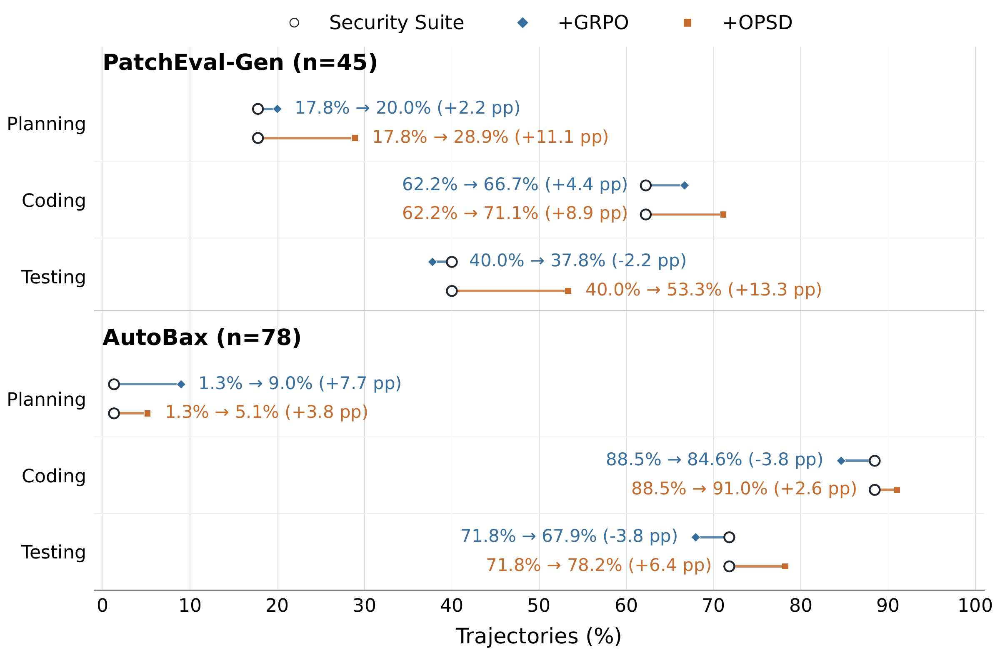

# SecureVibe: Making Vibe Coding More Secure

SecureVibe is a training recipe that teaches coding agents to identify and
address implicit security requirements through **security planning, coding,
and testing**. Functionally correct code can still be vulnerable; SecureVibe
combines structured supervised fine-tuning with post-training from executable
feedback or teacher-only security hints to improve secure task completion.

This repository accompanies **SecureVibe: Making Vibe Coding More Secure**
and provides the SFT, reinforcement learning, and on-policy distillation
workflows. Benchmark execution and grading live in the companion
[SecureVibeEval project](https://github.com/MSR-Orchard/SecureVibeEval).

[Training guides](#train-a-model) ·
[Evaluation](#evaluate-a-model-with-securevibeeval) ·
[Datasets](https://huggingface.co/datasets/dqwang122/SafeVibe)



*SecureVibe targets hidden security requirements with a mixture of security
tasks and post-training, helping agents produce functional and secure code.*

## Training recipe

### Security Suite: supervised fine-tuning

**SecureVibe-base** is the SFT checkpoint trained on a Security Suite with
four complementary tasks:

- **Functionality-Focused Coding:** implement a feature from its functional
  description, without vulnerability-specific guidance.
- **Security-Focused Coding:** implement the feature with instance-specific
  security guidance, such as a CWE category or CVE description.
- **Security Planning:** infer implicit security requirements from the feature
  description before implementation.
- **Security Testing:** generate tests that distinguish vulnerable and secure
  implementations, using the feature description and vulnerability information.

The paper's Security Suite contains 1,648 examples: 505 functionality-focused
coding, 938 security-focused coding, 95 security-planning, and 110 security-test
synthesis trajectories. Explicit planning and testing supervision improves
security more effectively than simply adding secure coding trajectories.



*Percentage of trajectories exhibiting each security behavior. Security Suite
outperforms Security Only (labeled “Sole Security”) and Simple Mixture on all
three behaviors in both benchmarks.*

### Post-training from outcomes or hints

Both post-training methods start from SecureVibe-base:

- **SecureVibe-rl** uses GRPO with executable feedback on patch validity,
  functional correctness, and security correctness. Dynamic sampling retains
  groups with reward variation and at least one positive outcome.
- **SecureVibe-hg** uses hint-guided on-policy self-distillation (OPSD).
  The student generates trajectories from the standard task prompt, while
  the teacher receives additional security guidance. Distilling the teacher's
  token-level predictions provides supervision even when successful secure
  outcomes are rare. Security hints are visible only to the teacher during
  training; the student does not require them at inference time.

The hint-guided workflow is implemented in `training/slime_opd/`; directory
names and launcher options retain the implementation abbreviation `opd`.



*Hint-guided OPSD increases all three security behaviors on both benchmarks.
GRPO's largest behavior gain is security planning on AutoBax. Labels show
percentage-point changes relative to Security Suite SFT; these are behavior
frequencies, not task pass rates.*

## Results reported in the paper

Experiments use **Qwen3.5-35B-A3B** with the **mini-swe-agent** harness.
Compared with the untrained Qwen baseline:

- **BaxBench:** SecureVibe-rl improves security pass@1 from 19.71% to 26.62%
  (**+6.9 percentage points**).
- **SusVibes:** SecureVibe-base and SecureVibe-rl improve functional pass@1
  from 28.14% to 41.76% (**+13.6 points**). SecureVibe-hg achieves the highest
  security pass@1 among the SecureVibe variants, at 14.16% versus 10.57% for
  the baseline.
- **Unseen vulnerability categories:** on the 78-instance SusVibes subset
  containing CWE IDs absent from both training datasets, SecureVibe-hg raises
  security pass@1 from 7.69% to 19.23% (**+11.5 points**).
- **SWE-bench Verified:** SecureVibe-base improves pass@1 from 60.90% to
  65.00% (**+4.1 points**), showing transfer to general software engineering.

**FuncPass** is pass@1 on functional tests. **SecPass** is pass@1 on solutions
that pass **both functional and security tests**. The full-benchmark figures
above are means over three runs; the unseen-CWE result is a separate subset
analysis. The strongest variant depends on the task: RL performs best on
BaxBench security, while hint-guided distillation performs best on SusVibes
security. Hint-guided training can also reduce functional correctness relative
to the SFT checkpoint, so both metrics matter.

## Benchmarks

Sizes and security coverage below describe the benchmark versions used in the
paper, rather than the full upstream collections. Benchmark names link to
their source projects.

| Benchmark | Tasks | Task type | Languages | CWE categories | Role in the paper |
| --- | ---: | --- | --- | ---: | --- |
| PatchEval-Gen (from [PatchEval](https://github.com/bytedance/PatchEval)) | 200 | Feature implementation in existing repositories | 3: JavaScript, Python, Go | 39 | Training and in-domain evaluation |
| AutoBaxBench (from [AutoBaxBuilder](https://github.com/eth-sri/autobaxbuilder)) | 560 | Backend web application generation from scratch | 6: JavaScript, Python, Go, Ruby, Rust, PHP | 9 | Training and in-domain evaluation |
| [BaxBench](https://github.com/logic-star-ai/baxbench) | 392 | Backend web application generation from scratch | 6: JavaScript, Python, Go, Ruby, Rust, PHP | 13 | Security generalization |
| [SusVibes](https://github.com/LeiLiLab/susvibes) | 186 | Security-sensitive feature implementation in existing repositories | Python | 76 | Security generalization |
| [SWE-bench Verified](https://www.swebench.com/verified.html) | 500 | Resolve real-world GitHub issues in existing repositories | Python | N/A | General software-engineering evaluation |

PatchEval-Gen adapts PatchEval vulnerability-repair instances into feature
implementation tasks and excludes CVE IDs shared with SusVibes. Its 200 tasks
are split into 100 for SFT data construction and 100 for post-training.
AutoBaxBench's 560 tasks cover 40 scenarios across 14 framework/language
configurations, with 140 tasks for SFT data construction and 420 for
post-training. BaxBench covers 28 scenarios across 14 configurations; its
scenarios do not overlap with AutoBaxBench.

CWE counts denote distinct vulnerability categories; a task may contain more
than one CWE. The four security benchmarks measure both functional and secure
task completion. SWE-bench Verified is a human-validated subset of SWE-bench
used to measure general issue resolution, without a separate security metric.

Some implementation and data names retain `SecureGen` or `patcheval` for
PatchEval-Gen, and `AutoBax` or `autobax` for AutoBaxBench.

## Repository layout

- [`training/slime_sft/`](training/slime_sft/README.md): supervised fine-tuning
  and checkpoint export.
- [`training/slime_rl/`](training/slime_rl/README.md): joint PatchEval-Gen and
  AutoBaxBench reinforcement learning for SecureVibe-rl.
- [`training/slime_opd/`](training/slime_opd/README.md): distillation with
  teacher-only security hints for SecureVibe-hg.
- [`data/`](data/README.md): training input inventories,
  source mappings, and checksums.
- [`dependencies/`](dependencies/orchard/README.md): pinned Orchard integration,
  bundled mini-swe-agent, and AutoBax training harness.

## Evaluate a model with SecureVibeEval

Use [SecureVibeEval](https://github.com/MSR-Orchard/SecureVibeEval) for model execution, multi-CLI agents,
and benchmark grading. SecureVibeEval has its own setup, dependencies, tests, and
raw-data manifests; it does not require the SecureVibe training stack.

Clone SecureVibeEval and follow its evaluation setup:

```bash
git clone https://github.com/MSR-Orchard/SecureVibeEval.git
cd SecureVibeEval/evaluation
./setup.sh
export MODEL=openai/your-model
export LOCAL_BASE=http://127.0.0.1:8200/v1
export OUTPUT_PREFIX=your-model
DRY_RUN=1 ./evaluate.sh
```

Follow the [SecureVibeEval quickstart](https://github.com/MSR-Orchard/SecureVibeEval) to configure model
and sandbox services, run evaluation, and grade the outputs. Evaluation inputs
now belong in `SecureVibeEval/data/raw/`; prepared training inputs remain here in
`data/recipes/`. Each project can be checked out independently.

## Train a model

Choose the [SFT](training/slime_sft/README.md),
[RL](training/slime_rl/README.md), or
[hint-guided distillation](training/slime_opd/README.md) guide.
Each workflow provides a `train.sh` launcher. Training requires NVIDIA GPUs,
compatible model checkpoints, prepared data, and the dependencies specified
in that workflow's guide.

Start with Security Suite SFT to obtain SecureVibe-base, then use that
checkpoint to initialize either post-training workflow. The paper reports
experiments on 8 NVIDIA B200 GPUs with a maximum sequence length of 128K
tokens. SFT uses 3 epochs, a global batch size of 32, and a learning rate of
1e-5; post-training uses 4 prompts with 8 samples per prompt. Launcher defaults
may differ from the paper's configuration; set the relevant overrides when
reproducing an experiment.

RL and OPD use the [pinned Orchard integration](dependencies/orchard/README.md)
and a deployed sandbox service. OPD also requires a teacher endpoint; hinted
samples require matching student and teacher tokenizer vocabularies.
The [Megatron dependency guide](dependencies/megatron-lm/README.md) provides
the pinned revision, reference patch, checksum, and installation commands.

## Data and dependencies

Training recipes and SecureVibeEval evaluation inputs are published in the
[SecureVibe dataset on Hugging Face](https://huggingface.co/datasets/dqwang122/SafeVibe):
[`recipes/`](https://huggingface.co/datasets/dqwang122/SafeVibe/tree/main/recipes)
for SecureVibe and [`raw/`](https://huggingface.co/datasets/dqwang122/SafeVibe/tree/main/raw)
for SecureVibeEval.

Dataset files, model weights, credentials, and generated results are excluded
from version control. Data manifests and documentation are included so inputs
can be identified and verified. Access to source datasets and benchmark images
is subject to their respective access requirements and terms.

The [mini-swe-agent dependency guide](dependencies/vendor/README.md) and
[AutoBax harness guide](dependencies/autobax_arc.README.md) document bundled
sources and checksum verification. See [third-party notices](THIRD_PARTY_NOTICES.md)
for bundled licenses and attribution, including AutoBaxBuilder's MIT license.

## Development checks

Training dependency checks and deployment validation are documented in the
individual workflow guides. Evaluation tests belong to
[SecureVibeEval](https://github.com/MSR-Orchard/SecureVibeEval#development-checks).

## License

SecureVibe's original code is released under the [MIT License](LICENSE).
Third-party components retain their own licenses; see
[third-party notices](THIRD_PARTY_NOTICES.md). The code license does not grant
access to or license benchmark datasets, model weights, or external services.
